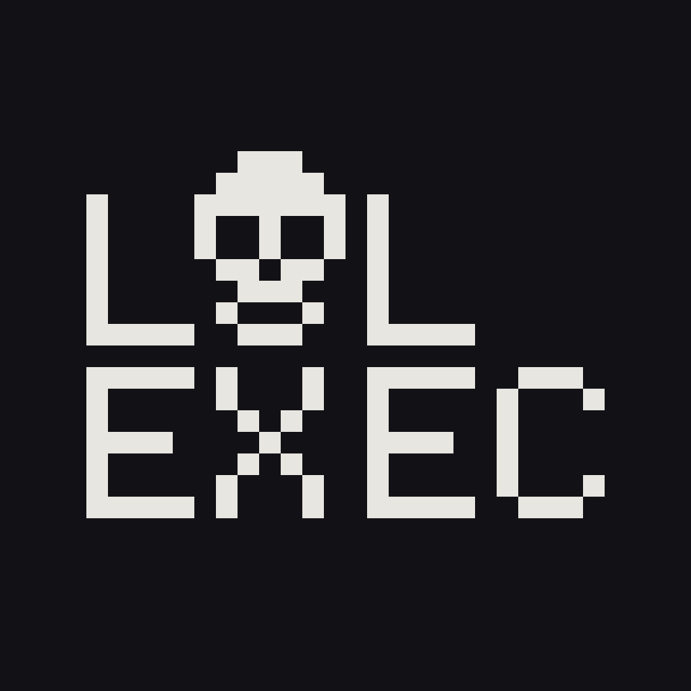
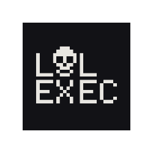

# LolExec

  

  

  
  
  

  
  
  

## About
We are a CTF team focused on playful, sharp problem solving across web, pwn, crypto, reverse, and forensics.
We build tools, publish writeups, and bring good vibes to the scoreboard.

## Active Projects
- Writeup templates and tooling
- Challenge infra and deployment helpers
- Internal cheat sheets and training labs

## CTF Timeline
- Scarlet 2026
- OUFTCTF 2026
- v1t 2025
- EPT 2025

## Stats

  

## Get in Touch
- Website: https://lolexec.no/

---
If you are from the CTF community and want to collaborate, open an issue or reach out.
